# Logical debugging report

**Scope:** Logical bugs and fixes (wrong behavior without crashing). 

---

## 1. `add_grade` — invalid scores still stored

Invalid scores print `Invalid grade` but are still appended, so averages include out-of-range values.

### How we figured it

In `__main__` we added **`maya.add_grade(105)`** right after **`maya.add_grade(95)`**, then printed averages. With the **buggy** `add_grade` (no `return` after the invalid branch), the run showed something like:

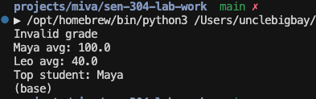

So the program **complained** about 105 but still **used** it: \((95 + 105) / 2 = 100\). We **expected** invalid scores **not** to be stored, so Maya’s average should stay **95.0**. That mismatch is how we flagged the logic bug (the debugger **Variables** / **Locals** panel on `self.grades` would also show `[95, 105]` after those calls).

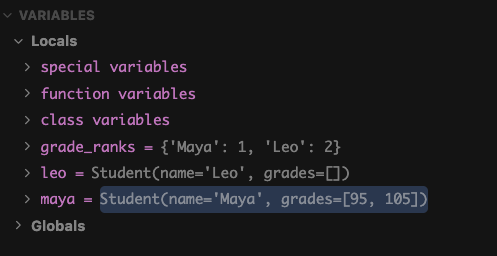

**Before:**

```python
    def add_grade(self, score: float) -> None:
        if score < 0 or score > 100:
            print("Invalid grade")
        self.grades.append(score)
```

**After:**

```python
    def add_grade(self, score: float) -> None:
        if score < 0 or score > 100:
            print("Invalid grade")
            return
        self.grades.append(score)
```


Terminal: Still shows **Invalid grade** for 105, but **Maya avg: 95.0** (not 100.0), only the valid 95 is included in the average.
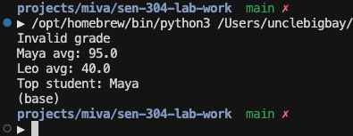


Debugger (Variables / Locals): **maya** shows **grades=[95]**, confirming 105 was not stored.
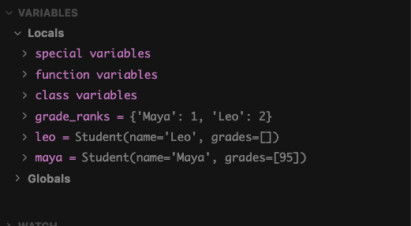

---

## 2. `letter_grade` — failing average returns A

The `if` / `elif` chain maps **A–D** for averages **≥ 60**, so the final `else` is only reached when **avg &lt; 60**. Returning **`"A"`** there contradicts that scale (a failing average is labeled the same as the top grade).

### How we figured it

We evaluated **`letter_grade`** with values **below 60** (**`print(letter_grade(55))`** in `main`). With the buggy `else` branch, the result was **`"A"`** even though **55** is not a passing average on the **60+ = D** scale. We **expected** **`"F"`** (or another explicit fail letter), not **`"A"`**.


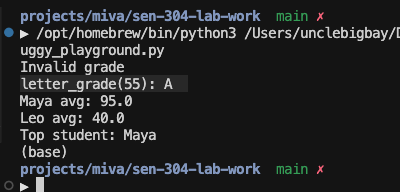

**Before:**

```python
def letter_grade(avg: float) -> str:
    if avg >= 90:
        return "A"
    elif avg >= 80:
        return "B"
    elif avg >= 70:
        return "C"
    elif avg >= 60:
        return "D"
    else:
        return "A"
```

**After:**

```python
def letter_grade(avg: float) -> str:
    if avg >= 90:
        return "A"
    elif avg >= 80:
        return "B"
    elif avg >= 70:
        return "C"
    elif avg >= 60:
        return "D"
    else:
        return "F"
```

After the fix, the same checks return **`"F"`** for averages under 60 (e.g. `letter_grade(55) == "F"`).

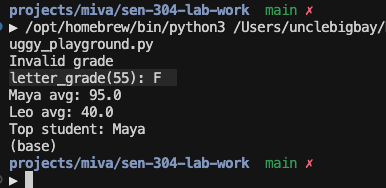

---

## 3. `parse_grade_line` — bad grades become zero silently

Out-of-range numeric grades are turned into **`0`** and returned as if valid, instead of failing.

### How we figured it

We called **`parse_grade_line("Ben,150")`** (**`print(parse_grade_line("Ben,150"))`** in `main`). The buggy code returned **`('Ben', 0.0)`**, which is a **made-up** grade. We **expected** an error or rejection, not a silent **0**.

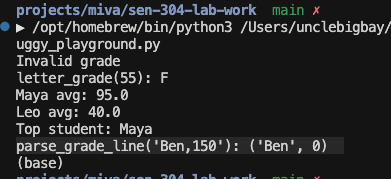

**Before:**

```python
def parse_grade_line(line: str) -> tuple[str, float]:
    name, grade = line.split(",")
    grade_float = float(grade)

    if grade_float > 100 or grade_float < 0:
        grade_float = 0
    return name.strip(), grade_float
```

**After:**

```python
def parse_grade_line(line: str) -> tuple[str, float]:
    name, grade = line.split(",")
    grade_float = float(grade)

    if grade_float > 100 or grade_float < 0:
        raise ValueError(f"Grade out of valid range 0–100: {grade_float}")
    return name.strip(), grade_float
```

After the fix, the same input **raises `ValueError`** instead of returning **`0`**.

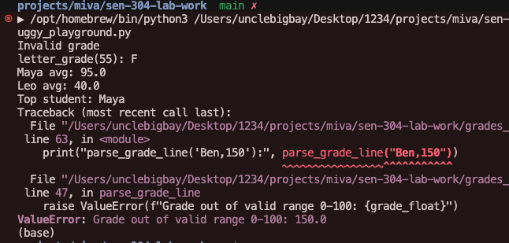

---

## 4. `average` — empty grades list

With **no** grades, **`len(self.grades)`** is **0**, so **`sum(...) / len(...)`** raises **`ZeroDivisionError`**.

### How we figured it

We created a **`Student`** and called **`.average()`** without any **`add_grade`** (e.g. **`sam = Student("Sam")`** then **`print(sam.average())`**). The buggy code crashed instead of returning a defined value.


```python
sam = Student("Sam")
print(sam.average())
```

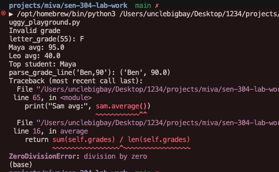

**Before:**

```python
    def average(self) -> float:
        return sum(self.grades) / len(self.grades)
```

**After:**

```python
    def average(self) -> float:
        if not self.grades:
            return 0.0
        return sum(self.grades) / len(self.grades)
```

After the fix, **`.average()`** on an empty list returns **`0.0`**.

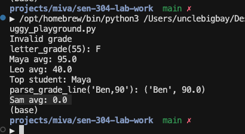

---

## 5. `top_student` / `grade_ranks` — unused `rank` and `KeyError`

**`rank`** is assigned but never used. **`grade_ranks[top.name]`** assumes every possible top student is in the dict — if the top student’s **name** is missing (e.g. **Sam** while the dict only has **Maya** / **Leo**), Python raises **`KeyError`**. An **empty** **`students`** list also makes **`max(...)`** fail.

### How we figured it

We added a student **not** listed in **`grade_ranks`** (e.g. **`Sam`**) with a **higher average** than the others, then called **`top_student([maya, leo, sam])`**. The winner was **Sam**, and the line **`grade_ranks[top.name]`** crashed:

```python
sam = Student("Sam")
sam.add_grade(100)
print("Top student:", top_student([maya, leo, sam]).name)
```

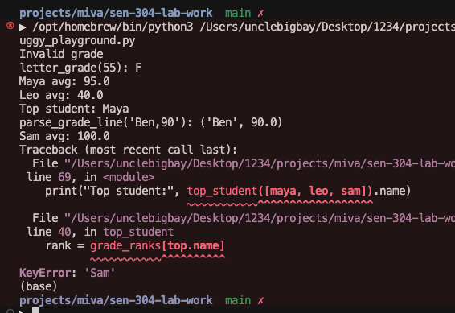

**Before:**

```python
def top_student(students: list[Student]) -> Student:
    top = max(students, key=lambda s: s.average())
    rank = grade_ranks[top.name]
    return top
```

**After:**

```python
def top_student(students: list[Student]) -> Student:
    if not students:
        raise ValueError("students list is empty")
    return max(students, key=lambda s: s.average())
```

Picking the top student by **average** does not require **`grade_ranks`**; removing the **`rank`** line avoids **`KeyError`** and the unused variable.

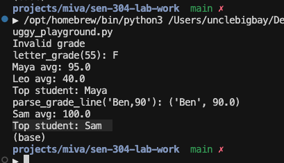

---

## 6. Exception handling in `main` 

Besides **raising** `ValueError` inside helpers (e.g. **`parse_grade_line`**, **`top_student`**), we **handle** runtime errors at the **program boundary** with **`try` / `except`** so the user sees a short message instead of an uncaught traceback when something goes wrong.

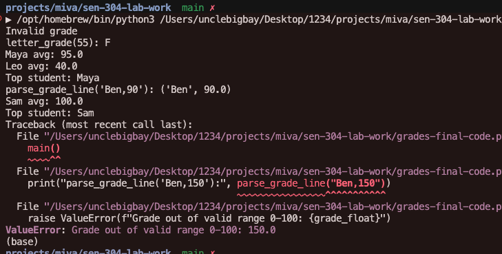

**Implementation** (in **`grades_final_code.py`**): the demo logic lives in **`main()`**, and **`if __name__ == "__main__":`** wraps **`main()`** in **`try` / `except ValueError`**.

```python
def main() -> None:
    maya = Student("Maya")

if __name__ == "__main__":
    try:
        main()
    except ValueError as e:
        print(f"Error (invalid value or state): {e}")
```

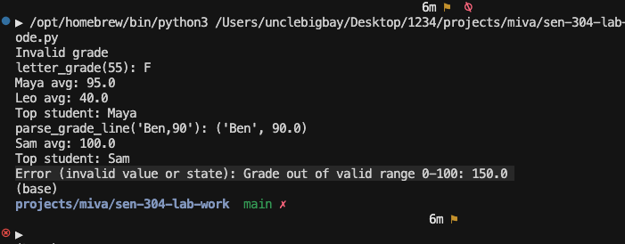